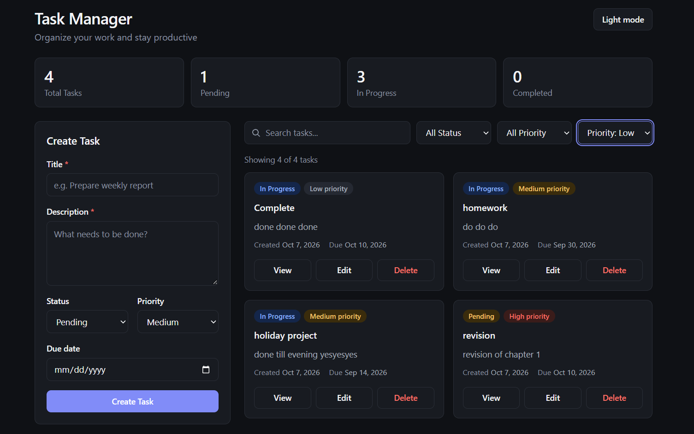
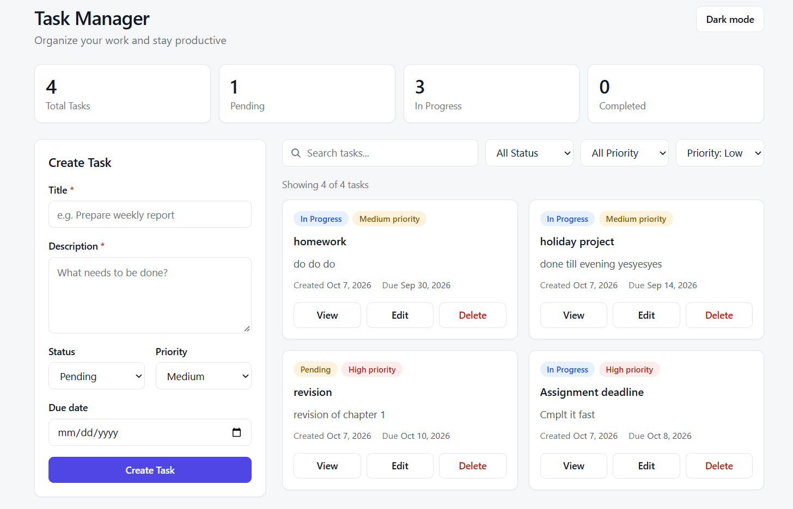
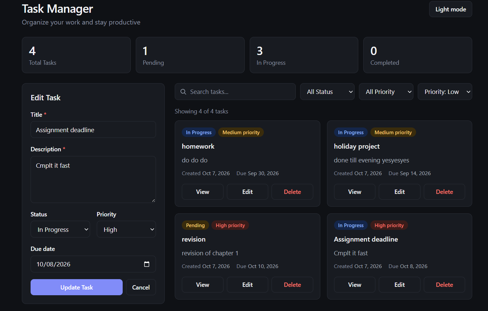
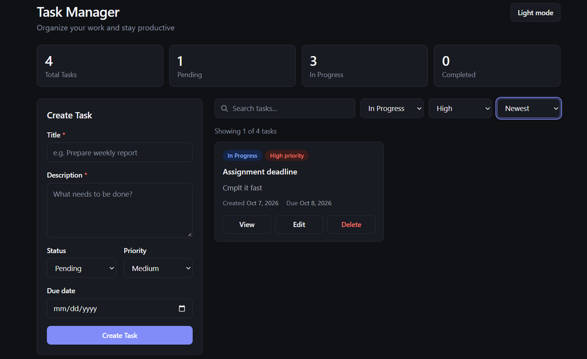
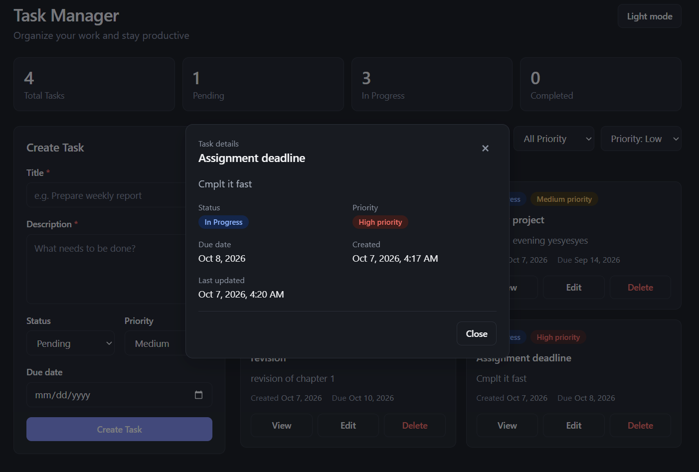

# Task Management System

A full-stack Task Management application built with React, Node.js, and Express.js. The application allows users to create, view, update, delete, search, filter, and sort tasks through a responsive dashboard.

The project uses in-memory backend storage as required by the assignment, so no database is required.

## Features

- Create tasks
- Edit existing tasks
- Delete tasks
- View complete task details
- Search tasks by title or description
- Filter tasks by status
- Filter tasks by priority
- Sort tasks by creation date and due date
- Task status and priority indicators
- Dashboard task statistics
- Client-side form validation
- Backend request validation
- Loading, empty, and error states
- Responsive desktop, tablet, and mobile UI
- RESTful API architecture
- Centralized backend error handling

## Tech Stack

### Frontend

- React.js
- Vite
- JavaScript
- Axios
- CSS

### Backend

- Node.js
- Express.js
- CORS
- dotenv
- Nodemon

### Development Tools

- Git
- GitHub
- Postman

## Project Structure

```text
task-management-system/
│
├── backend/
│   ├── src/
│   │   ├── controllers/
│   │   │   └── task.controller.js
│   │   ├── middleware/
│   │   │   ├── errorHandler.js
│   │   │   └── validateTask.js
│   │   ├── routes/
│   │   │   └── task.routes.js
│   │   ├── services/
│   │   │   └── task.service.js
│   │   ├── app.js
│   │   └── server.js
│   ├── .env.example
│   └── package.json
│
├── frontend/
│   ├── src/
│   │   ├── components/
│   │   │   ├── TaskCard.jsx
│   │   │   ├── TaskDetails.jsx
│   │   │   └── TaskForm.jsx
│   │   ├── pages/
│   │   │   └── Dashboard.jsx
│   │   ├── services/
│   │   │   └── taskApi.js
│   │   ├── App.jsx
│   │   └── main.jsx
│   ├── .env.example
│   └── package.json
│
├── .gitignore
└── README.md
```

## Getting Started

### Prerequisites

Make sure the following are installed:

- Node.js
- npm
- Git

Clone the repository:

```bash
git clone https://github.com/Roshan-keshri/assignment-task-manager.git
cd assignment-task-manager
```

## Backend Setup

Move into the backend directory:

```bash
cd backend
npm install
```

Create a `.env` file based on `.env.example`:

```env
PORT=5000
```

Start the backend development server:

```bash
npm run dev
```

The backend will run on:

```text
http://localhost:5000
```

## Frontend Setup

Open another terminal and move into the frontend directory:

```bash
cd frontend
npm install
```

Create a `.env` file based on `.env.example`:

```env
VITE_API_URL=http://localhost:5000/api
```

Start the frontend:

```bash
npm run dev
```

Open the local URL displayed by Vite in your browser.

## Task Data Model

A task follows this structure:

```json
{
  "id": "string",
  "title": "Complete assignment",
  "description": "Finish the task management application",
  "status": "pending",
  "priority": "high",
  "dueDate": "2026-10-10",
  "createdAt": "2026-10-07T10:00:00.000Z",
  "updatedAt": "2026-10-07T10:00:00.000Z"
}
```

### Status Values

```text
pending
in_progress
completed
```

### Priority Values

```text
low
medium
high
```

## REST API Documentation

Base URL:

```text
http://localhost:5000/api
```

### Get All Tasks

```http
GET /api/tasks
```

Successful response:

```text
200 OK
```

### Get Task By ID

```http
GET /api/tasks/:id
```

Responses:

```text
200 OK
404 Not Found
```

### Create Task

```http
POST /api/tasks
```

Example request body:

```json
{
  "title": "Complete assignment",
  "description": "Finish the full-stack task manager",
  "status": "pending",
  "priority": "high",
  "dueDate": "2026-10-10"
}
```

Responses:

```text
201 Created
400 Bad Request
```

`title` and `description` are required.

### Update Task

```http
PUT /api/tasks/:id
```

Example request body:

```json
{
  "title": "Complete assignment",
  "description": "Finish and review the full-stack task manager",
  "status": "in_progress",
  "priority": "high",
  "dueDate": "2026-10-10"
}
```

Responses:

```text
200 OK
400 Bad Request
404 Not Found
```

### Delete Task

```http
DELETE /api/tasks/:id
```

Responses:

```text
200 OK
404 Not Found
```

## Validation

The application performs validation on both the frontend and backend.

- Title is required
- Description is required
- Status must be `pending`, `in_progress`, or `completed`
- Priority must be `low`, `medium`, or `high`

Invalid requests return a `400 Bad Request` response.

## Architecture

The backend follows a layered structure:

```text
Route
  ↓
Controller
  ↓
Service
  ↓
In-memory storage
```

### Routes

Define API endpoints and connect requests to controllers.

### Controllers

Handle HTTP requests and responses.

### Services

Contain task-related business logic and manage the in-memory task collection.

### Middleware

Handles request validation and centralized error handling.

The frontend keeps API communication in a dedicated service layer instead of making Axios requests directly throughout the UI.

## In-Memory Storage

This project intentionally does not use a database.

Tasks are stored in backend memory while the server is running. Restarting the backend server resets the task list.

This behavior is intentional and follows the assignment requirements.

## Search, Filter and Sorting

The dashboard supports:

- Search by task title
- Search by task description
- Filter by status
- Filter by priority
- Sort by newest
- Sort by oldest
- Sort by due date

These operations are performed on the frontend using the task data returned by the REST API.

## Screenshots

Screenshots of the completed application can be added here.

### Dashboard




### Create / Edit Task




### Task Details



## API Testing

The REST APIs can be tested using Postman.

Recommended requests:

```text
GET     /api/tasks
GET     /api/tasks/:id
POST    /api/tasks
PUT     /api/tasks/:id
DELETE  /api/tasks/:id
```

Test both successful requests and error cases such as invalid task data and unknown task IDs.

## Environment Variables

### Backend

```env
PORT=5000
```

### Frontend

```env
VITE_API_URL=http://localhost:5000/api
```

Actual `.env` files are excluded from Git. `.env.example` files are provided for setup.

## Author

**Roshan Kumar Keshri**

GitHub: @Roshan-keshri